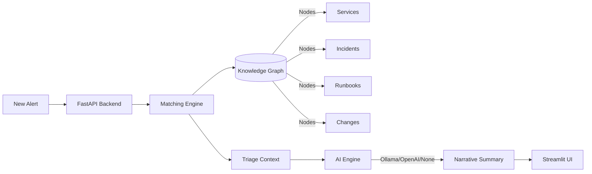

# 🛡️ Incident Airlock Graph

**Retrieval-Driven Incident Analysis & Triage System**

[](https://github.com/jayachandra-poldasu/incident-airlock-graph/actions)
[](https://www.python.org/downloads/)
[](LICENSE)

Incident Airlock Graph is an intelligent SRE tool that matches current alerts with historical incidents, runbooks, ownership metadata, and change context to produce **evidence-backed triage summaries**. 

It uses a custom **deterministic matching engine** paired with **pluggable AI analysis** (Ollama/OpenAI) to model operational knowledge retrieval using structured incident history and service dependency metadata.

---

## ⚡ Interview Quick Start

> **Runs fully offline without GPU or API keys.** Just Python 3.11+.

### Step 1 — Clone & Setup (30 seconds)

```bash
git clone https://github.com/jayachandra-poldasu/incident-airlock-graph.git
cd incident-airlock-graph
python3 -m venv venv && source venv/bin/activate
pip install -r requirements.txt -r requirements-dev.txt
```

### Step 2 — Run Tests (Verified Quality)

```bash
AIRLOCK_AI_BACKEND=none pytest tests/ -v --tb=short --cov=app --cov-report=term-missing
```

### Step 3 — Start API Server

```bash
AIRLOCK_AI_BACKEND=none uvicorn app.main:app --reload
```

> Server starts at http://localhost:8000 — open http://localhost:8000/docs for Swagger UI

### Step 4 — Launch Streamlit Dashboard (open a 2nd terminal)

```bash
source venv/bin/activate
streamlit run ui.py
```

> Opens at http://localhost:8501 — use the **Demo Scenario buttons** in the sidebar for an instant interactive demo!

---

## 🎯 How It Works (The Matching Engine)

When a new alert arrives, the triage engine executes a multi-dimensional retrieval:

1. **Incident Matching**: Uses Jaccard similarity on text and traverses the service dependency graph to find related past failures.
2. **Change Correlation**: Scans recent deployments and config changes on the affected service and its direct dependencies within a 48h window.
3. **Owner Identification**: Scores candidates based on service ownership, current on-call schedules, and who successfully resolved similar matched incidents.
4. **Runbook Retrieval**: Recommends runbooks based on category mapping and historical success rates from matched incidents.
5. **AI Synthesis**: Generates a concise, actionable narrative combining all retrieved context (can be deterministic fallback if no LLM is available).

---

## 🏗️ Architecture



---

## 📡 API Endpoints

| Method | Endpoint | Description |
|--------|----------|-------------|
| `POST` | `/triage` | Submit an alert, get full triage analysis |
| `GET` | `/services` | List service map with ownership & dependencies |
| `GET` | `/incidents` | List historical incidents with filters |
| `GET` | `/runbooks` | List runbooks with success rates |
| `GET` | `/changes` | Recent changes and deployments |
| `GET` | `/health` | System health check and graph stats |

### Example Response (`POST /triage`)

```json
{
  "triage_id": "a1b2c3d4",
  "status": "complete",
  "likely_owner": {
    "recommended_owner": "Alice Chen",
    "team": "Payments Team",
    "confidence": 0.8,
    "evidence": ["Primary service owner", "Resolved similar incident inc-2023-01"]
  },
  "change_correlations": [
    {
      "change": { "id": "chg-current-01", "change_type": "deployment" },
      "time_delta_minutes": 15
    }
  ],
  "runbook_suggestions": [
    {
      "runbook": { "id": "rb-pay-01", "title": "Resolve Payment Gateway Timeouts" },
      "relevance_score": 0.9
    }
  ],
  "ai_summary": "Deterministic Triage Summary for payment-service: ..."
}
```

---

## 🐳 Docker Setup

```bash
# Full stack (API + UI + Ollama)
docker-compose up --build

# Access:
#   API:     http://localhost:8000
#   UI:      http://localhost:8501
```

---

Built by [Jayachandra Poldasu](https://www.linkedin.com/in/jayachandra-poldasu/) as a demonstration of retrieval-driven operational analytics.